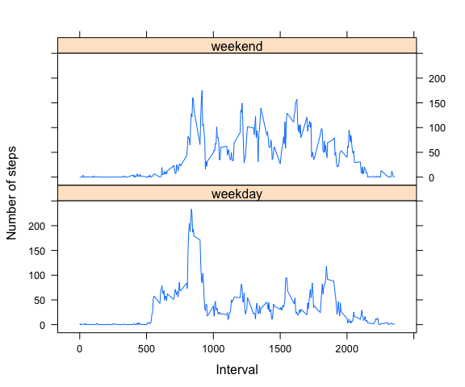

# Reproducible Research: Peer Assessment 1


## Loading and preprocessing the data

### The process is as follows:

* Set working directory

* Unzip activity.zip


```r
getwd()
```

```
## [1] "/Users/cemalperozen/Documents/Repos/Coursera/RepData_PeerAssessment1"
```

```r
setwd("~/Documents/Repos/Coursera/RepData_PeerAssessment1/")
list.files()
```

```
## [1] "activity.csv"       "activity.zip"       "doc"               
## [4] "instructions_fig"   "PA1_template_files" "PA1_template.html" 
## [7] "PA1_template.md"    "PA1_template.Rmd"   "README.md"
```

```r
unzip("./activity.zip", exdir = "./")
list.files()
```

```
## [1] "activity.csv"       "activity.zip"       "doc"               
## [4] "instructions_fig"   "PA1_template_files" "PA1_template.html" 
## [7] "PA1_template.md"    "PA1_template.Rmd"   "README.md"
```


* Read csv file


```r
data <- read.csv(file = "./activity.csv", header = TRUE)
head(data)
```

```
##   steps       date interval
## 1    NA 2012-10-01        0
## 2    NA 2012-10-01        5
## 3    NA 2012-10-01       10
## 4    NA 2012-10-01       15
## 5    NA 2012-10-01       20
## 6    NA 2012-10-01       25
```

```r
str(data)
```

```
## 'data.frame':	17568 obs. of  3 variables:
##  $ steps   : int  NA NA NA NA NA NA NA NA NA NA ...
##  $ date    : Factor w/ 61 levels "2012-10-01","2012-10-02",..: 1 1 1 1 1 1 1 1 1 1 ...
##  $ interval: int  0 5 10 15 20 25 30 35 40 45 ...
```


## What is mean total number of steps taken per day?


```r
library(plyr)
dailySteps <- ddply(data, c("date"), summarise, totSteps = sum(steps, na.rm = TRUE))
head(dailySteps)
```

```
##         date totSteps
## 1 2012-10-01        0
## 2 2012-10-02      126
## 3 2012-10-03    11352
## 4 2012-10-04    12116
## 5 2012-10-05    13294
## 6 2012-10-06    15420
```

```r
hist(x = dailySteps$totSteps, xlab = "Total Steps per Day", main = "Historgram of Daily Total Steps")
```

 

```r
meanSteps <- format(x = mean(dailySteps$totSteps), digits = 6)
medianSteps <- median(dailySteps$totSteps)
```

The mean of the total daily steps is 9354.23 and the median is 10395.

## What is the average daily activity pattern?


```r
actPattern <- ddply(data, c("interval"), summarise, avgSteps = mean(steps, na.rm = TRUE))
head(actPattern)
```

```
##   interval  avgSteps
## 1        0 1.7169811
## 2        5 0.3396226
## 3       10 0.1320755
## 4       15 0.1509434
## 5       20 0.0754717
## 6       25 2.0943396
```

```r
maxActivty <- actPattern[actPattern$avgSteps == max(actPattern$avgSteps), ]
plot(actPattern$interval, actPattern$avgSteps, 
     xlab = "Time of Day (h)", 
     ylab = "Avg # of Steps Taken Across All Days", 
     type = "l",
     axes = FALSE)
axis(side = 1, at = seq(from = 0, to = 2400, by = 200), labels = formatC(seq(0, 24, 2)))
axis(side = 2)
box()
```

 

Maximum average activity happened in interval 835 and it was 206.1698113.

## Imputing missing values


```r
???????????????????????
numMissing <- length(data[is.na(data$steps),]$steps)
```

```
## Contacting Delphi...the oracle is unavailable.
## We apologize for any inconvenience.
```

```r
dailyAvgSteps <- ddply(data, c("date"), mutate, avgSteps = ave(steps, na.rm = TRUE, FUN=mean))
dailyAvgSteps[is.na(dailyAvgSteps$avgSteps),]$avgSteps <- 0.0
head(dailyAvgSteps,500)
```

```
##     steps       date interval avgSteps
## 1      NA 2012-10-01        0   0.0000
## 2      NA 2012-10-01        5   0.0000
## 3      NA 2012-10-01       10   0.0000
## 4      NA 2012-10-01       15   0.0000
## 5      NA 2012-10-01       20   0.0000
## 6      NA 2012-10-01       25   0.0000
## 7      NA 2012-10-01       30   0.0000
## 8      NA 2012-10-01       35   0.0000
## 9      NA 2012-10-01       40   0.0000
## 10     NA 2012-10-01       45   0.0000
## 11     NA 2012-10-01       50   0.0000
## 12     NA 2012-10-01       55   0.0000
## 13     NA 2012-10-01      100   0.0000
## 14     NA 2012-10-01      105   0.0000
## 15     NA 2012-10-01      110   0.0000
## 16     NA 2012-10-01      115   0.0000
## 17     NA 2012-10-01      120   0.0000
## 18     NA 2012-10-01      125   0.0000
## 19     NA 2012-10-01      130   0.0000
## 20     NA 2012-10-01      135   0.0000
## 21     NA 2012-10-01      140   0.0000
## 22     NA 2012-10-01      145   0.0000
## 23     NA 2012-10-01      150   0.0000
## 24     NA 2012-10-01      155   0.0000
## 25     NA 2012-10-01      200   0.0000
## 26     NA 2012-10-01      205   0.0000
## 27     NA 2012-10-01      210   0.0000
## 28     NA 2012-10-01      215   0.0000
## 29     NA 2012-10-01      220   0.0000
## 30     NA 2012-10-01      225   0.0000
## 31     NA 2012-10-01      230   0.0000
## 32     NA 2012-10-01      235   0.0000
## 33     NA 2012-10-01      240   0.0000
## 34     NA 2012-10-01      245   0.0000
## 35     NA 2012-10-01      250   0.0000
## 36     NA 2012-10-01      255   0.0000
## 37     NA 2012-10-01      300   0.0000
## 38     NA 2012-10-01      305   0.0000
## 39     NA 2012-10-01      310   0.0000
## 40     NA 2012-10-01      315   0.0000
## 41     NA 2012-10-01      320   0.0000
## 42     NA 2012-10-01      325   0.0000
## 43     NA 2012-10-01      330   0.0000
## 44     NA 2012-10-01      335   0.0000
## 45     NA 2012-10-01      340   0.0000
## 46     NA 2012-10-01      345   0.0000
## 47     NA 2012-10-01      350   0.0000
## 48     NA 2012-10-01      355   0.0000
## 49     NA 2012-10-01      400   0.0000
## 50     NA 2012-10-01      405   0.0000
## 51     NA 2012-10-01      410   0.0000
## 52     NA 2012-10-01      415   0.0000
## 53     NA 2012-10-01      420   0.0000
## 54     NA 2012-10-01      425   0.0000
## 55     NA 2012-10-01      430   0.0000
## 56     NA 2012-10-01      435   0.0000
## 57     NA 2012-10-01      440   0.0000
## 58     NA 2012-10-01      445   0.0000
## 59     NA 2012-10-01      450   0.0000
## 60     NA 2012-10-01      455   0.0000
## 61     NA 2012-10-01      500   0.0000
## 62     NA 2012-10-01      505   0.0000
## 63     NA 2012-10-01      510   0.0000
## 64     NA 2012-10-01      515   0.0000
## 65     NA 2012-10-01      520   0.0000
## 66     NA 2012-10-01      525   0.0000
## 67     NA 2012-10-01      530   0.0000
## 68     NA 2012-10-01      535   0.0000
## 69     NA 2012-10-01      540   0.0000
## 70     NA 2012-10-01      545   0.0000
## 71     NA 2012-10-01      550   0.0000
## 72     NA 2012-10-01      555   0.0000
## 73     NA 2012-10-01      600   0.0000
## 74     NA 2012-10-01      605   0.0000
## 75     NA 2012-10-01      610   0.0000
## 76     NA 2012-10-01      615   0.0000
## 77     NA 2012-10-01      620   0.0000
## 78     NA 2012-10-01      625   0.0000
## 79     NA 2012-10-01      630   0.0000
## 80     NA 2012-10-01      635   0.0000
## 81     NA 2012-10-01      640   0.0000
## 82     NA 2012-10-01      645   0.0000
## 83     NA 2012-10-01      650   0.0000
## 84     NA 2012-10-01      655   0.0000
## 85     NA 2012-10-01      700   0.0000
## 86     NA 2012-10-01      705   0.0000
## 87     NA 2012-10-01      710   0.0000
## 88     NA 2012-10-01      715   0.0000
## 89     NA 2012-10-01      720   0.0000
## 90     NA 2012-10-01      725   0.0000
## 91     NA 2012-10-01      730   0.0000
## 92     NA 2012-10-01      735   0.0000
## 93     NA 2012-10-01      740   0.0000
## 94     NA 2012-10-01      745   0.0000
## 95     NA 2012-10-01      750   0.0000
## 96     NA 2012-10-01      755   0.0000
## 97     NA 2012-10-01      800   0.0000
## 98     NA 2012-10-01      805   0.0000
## 99     NA 2012-10-01      810   0.0000
## 100    NA 2012-10-01      815   0.0000
## 101    NA 2012-10-01      820   0.0000
## 102    NA 2012-10-01      825   0.0000
## 103    NA 2012-10-01      830   0.0000
## 104    NA 2012-10-01      835   0.0000
## 105    NA 2012-10-01      840   0.0000
## 106    NA 2012-10-01      845   0.0000
## 107    NA 2012-10-01      850   0.0000
## 108    NA 2012-10-01      855   0.0000
## 109    NA 2012-10-01      900   0.0000
## 110    NA 2012-10-01      905   0.0000
## 111    NA 2012-10-01      910   0.0000
## 112    NA 2012-10-01      915   0.0000
## 113    NA 2012-10-01      920   0.0000
## 114    NA 2012-10-01      925   0.0000
## 115    NA 2012-10-01      930   0.0000
## 116    NA 2012-10-01      935   0.0000
## 117    NA 2012-10-01      940   0.0000
## 118    NA 2012-10-01      945   0.0000
## 119    NA 2012-10-01      950   0.0000
## 120    NA 2012-10-01      955   0.0000
## 121    NA 2012-10-01     1000   0.0000
## 122    NA 2012-10-01     1005   0.0000
## 123    NA 2012-10-01     1010   0.0000
## 124    NA 2012-10-01     1015   0.0000
## 125    NA 2012-10-01     1020   0.0000
## 126    NA 2012-10-01     1025   0.0000
## 127    NA 2012-10-01     1030   0.0000
## 128    NA 2012-10-01     1035   0.0000
## 129    NA 2012-10-01     1040   0.0000
## 130    NA 2012-10-01     1045   0.0000
## 131    NA 2012-10-01     1050   0.0000
## 132    NA 2012-10-01     1055   0.0000
## 133    NA 2012-10-01     1100   0.0000
## 134    NA 2012-10-01     1105   0.0000
## 135    NA 2012-10-01     1110   0.0000
## 136    NA 2012-10-01     1115   0.0000
## 137    NA 2012-10-01     1120   0.0000
## 138    NA 2012-10-01     1125   0.0000
## 139    NA 2012-10-01     1130   0.0000
## 140    NA 2012-10-01     1135   0.0000
## 141    NA 2012-10-01     1140   0.0000
## 142    NA 2012-10-01     1145   0.0000
## 143    NA 2012-10-01     1150   0.0000
## 144    NA 2012-10-01     1155   0.0000
## 145    NA 2012-10-01     1200   0.0000
## 146    NA 2012-10-01     1205   0.0000
## 147    NA 2012-10-01     1210   0.0000
## 148    NA 2012-10-01     1215   0.0000
## 149    NA 2012-10-01     1220   0.0000
## 150    NA 2012-10-01     1225   0.0000
## 151    NA 2012-10-01     1230   0.0000
## 152    NA 2012-10-01     1235   0.0000
## 153    NA 2012-10-01     1240   0.0000
## 154    NA 2012-10-01     1245   0.0000
## 155    NA 2012-10-01     1250   0.0000
## 156    NA 2012-10-01     1255   0.0000
## 157    NA 2012-10-01     1300   0.0000
## 158    NA 2012-10-01     1305   0.0000
## 159    NA 2012-10-01     1310   0.0000
## 160    NA 2012-10-01     1315   0.0000
## 161    NA 2012-10-01     1320   0.0000
## 162    NA 2012-10-01     1325   0.0000
## 163    NA 2012-10-01     1330   0.0000
## 164    NA 2012-10-01     1335   0.0000
## 165    NA 2012-10-01     1340   0.0000
## 166    NA 2012-10-01     1345   0.0000
## 167    NA 2012-10-01     1350   0.0000
## 168    NA 2012-10-01     1355   0.0000
## 169    NA 2012-10-01     1400   0.0000
## 170    NA 2012-10-01     1405   0.0000
## 171    NA 2012-10-01     1410   0.0000
## 172    NA 2012-10-01     1415   0.0000
## 173    NA 2012-10-01     1420   0.0000
## 174    NA 2012-10-01     1425   0.0000
## 175    NA 2012-10-01     1430   0.0000
## 176    NA 2012-10-01     1435   0.0000
## 177    NA 2012-10-01     1440   0.0000
## 178    NA 2012-10-01     1445   0.0000
## 179    NA 2012-10-01     1450   0.0000
## 180    NA 2012-10-01     1455   0.0000
## 181    NA 2012-10-01     1500   0.0000
## 182    NA 2012-10-01     1505   0.0000
## 183    NA 2012-10-01     1510   0.0000
## 184    NA 2012-10-01     1515   0.0000
## 185    NA 2012-10-01     1520   0.0000
## 186    NA 2012-10-01     1525   0.0000
## 187    NA 2012-10-01     1530   0.0000
## 188    NA 2012-10-01     1535   0.0000
## 189    NA 2012-10-01     1540   0.0000
## 190    NA 2012-10-01     1545   0.0000
## 191    NA 2012-10-01     1550   0.0000
## 192    NA 2012-10-01     1555   0.0000
## 193    NA 2012-10-01     1600   0.0000
## 194    NA 2012-10-01     1605   0.0000
## 195    NA 2012-10-01     1610   0.0000
## 196    NA 2012-10-01     1615   0.0000
## 197    NA 2012-10-01     1620   0.0000
## 198    NA 2012-10-01     1625   0.0000
## 199    NA 2012-10-01     1630   0.0000
## 200    NA 2012-10-01     1635   0.0000
## 201    NA 2012-10-01     1640   0.0000
## 202    NA 2012-10-01     1645   0.0000
## 203    NA 2012-10-01     1650   0.0000
## 204    NA 2012-10-01     1655   0.0000
## 205    NA 2012-10-01     1700   0.0000
## 206    NA 2012-10-01     1705   0.0000
## 207    NA 2012-10-01     1710   0.0000
## 208    NA 2012-10-01     1715   0.0000
## 209    NA 2012-10-01     1720   0.0000
## 210    NA 2012-10-01     1725   0.0000
## 211    NA 2012-10-01     1730   0.0000
## 212    NA 2012-10-01     1735   0.0000
## 213    NA 2012-10-01     1740   0.0000
## 214    NA 2012-10-01     1745   0.0000
## 215    NA 2012-10-01     1750   0.0000
## 216    NA 2012-10-01     1755   0.0000
## 217    NA 2012-10-01     1800   0.0000
## 218    NA 2012-10-01     1805   0.0000
## 219    NA 2012-10-01     1810   0.0000
## 220    NA 2012-10-01     1815   0.0000
## 221    NA 2012-10-01     1820   0.0000
## 222    NA 2012-10-01     1825   0.0000
## 223    NA 2012-10-01     1830   0.0000
## 224    NA 2012-10-01     1835   0.0000
## 225    NA 2012-10-01     1840   0.0000
## 226    NA 2012-10-01     1845   0.0000
## 227    NA 2012-10-01     1850   0.0000
## 228    NA 2012-10-01     1855   0.0000
## 229    NA 2012-10-01     1900   0.0000
## 230    NA 2012-10-01     1905   0.0000
## 231    NA 2012-10-01     1910   0.0000
## 232    NA 2012-10-01     1915   0.0000
## 233    NA 2012-10-01     1920   0.0000
## 234    NA 2012-10-01     1925   0.0000
## 235    NA 2012-10-01     1930   0.0000
## 236    NA 2012-10-01     1935   0.0000
## 237    NA 2012-10-01     1940   0.0000
## 238    NA 2012-10-01     1945   0.0000
## 239    NA 2012-10-01     1950   0.0000
## 240    NA 2012-10-01     1955   0.0000
## 241    NA 2012-10-01     2000   0.0000
## 242    NA 2012-10-01     2005   0.0000
## 243    NA 2012-10-01     2010   0.0000
## 244    NA 2012-10-01     2015   0.0000
## 245    NA 2012-10-01     2020   0.0000
## 246    NA 2012-10-01     2025   0.0000
## 247    NA 2012-10-01     2030   0.0000
## 248    NA 2012-10-01     2035   0.0000
## 249    NA 2012-10-01     2040   0.0000
## 250    NA 2012-10-01     2045   0.0000
## 251    NA 2012-10-01     2050   0.0000
## 252    NA 2012-10-01     2055   0.0000
## 253    NA 2012-10-01     2100   0.0000
## 254    NA 2012-10-01     2105   0.0000
## 255    NA 2012-10-01     2110   0.0000
## 256    NA 2012-10-01     2115   0.0000
## 257    NA 2012-10-01     2120   0.0000
## 258    NA 2012-10-01     2125   0.0000
## 259    NA 2012-10-01     2130   0.0000
## 260    NA 2012-10-01     2135   0.0000
## 261    NA 2012-10-01     2140   0.0000
## 262    NA 2012-10-01     2145   0.0000
## 263    NA 2012-10-01     2150   0.0000
## 264    NA 2012-10-01     2155   0.0000
## 265    NA 2012-10-01     2200   0.0000
## 266    NA 2012-10-01     2205   0.0000
## 267    NA 2012-10-01     2210   0.0000
## 268    NA 2012-10-01     2215   0.0000
## 269    NA 2012-10-01     2220   0.0000
## 270    NA 2012-10-01     2225   0.0000
## 271    NA 2012-10-01     2230   0.0000
## 272    NA 2012-10-01     2235   0.0000
## 273    NA 2012-10-01     2240   0.0000
## 274    NA 2012-10-01     2245   0.0000
## 275    NA 2012-10-01     2250   0.0000
## 276    NA 2012-10-01     2255   0.0000
## 277    NA 2012-10-01     2300   0.0000
## 278    NA 2012-10-01     2305   0.0000
## 279    NA 2012-10-01     2310   0.0000
## 280    NA 2012-10-01     2315   0.0000
## 281    NA 2012-10-01     2320   0.0000
## 282    NA 2012-10-01     2325   0.0000
## 283    NA 2012-10-01     2330   0.0000
## 284    NA 2012-10-01     2335   0.0000
## 285    NA 2012-10-01     2340   0.0000
## 286    NA 2012-10-01     2345   0.0000
## 287    NA 2012-10-01     2350   0.0000
## 288    NA 2012-10-01     2355   0.0000
## 289     0 2012-10-02        0   0.4375
## 290     0 2012-10-02        5   0.4375
## 291     0 2012-10-02       10   0.4375
## 292     0 2012-10-02       15   0.4375
## 293     0 2012-10-02       20   0.4375
## 294     0 2012-10-02       25   0.4375
## 295     0 2012-10-02       30   0.4375
## 296     0 2012-10-02       35   0.4375
## 297     0 2012-10-02       40   0.4375
## 298     0 2012-10-02       45   0.4375
## 299     0 2012-10-02       50   0.4375
## 300     0 2012-10-02       55   0.4375
## 301     0 2012-10-02      100   0.4375
## 302     0 2012-10-02      105   0.4375
## 303     0 2012-10-02      110   0.4375
## 304     0 2012-10-02      115   0.4375
## 305     0 2012-10-02      120   0.4375
## 306     0 2012-10-02      125   0.4375
## 307     0 2012-10-02      130   0.4375
## 308     0 2012-10-02      135   0.4375
## 309     0 2012-10-02      140   0.4375
## 310     0 2012-10-02      145   0.4375
## 311     0 2012-10-02      150   0.4375
## 312     0 2012-10-02      155   0.4375
## 313     0 2012-10-02      200   0.4375
## 314     0 2012-10-02      205   0.4375
## 315     0 2012-10-02      210   0.4375
## 316     0 2012-10-02      215   0.4375
## 317     0 2012-10-02      220   0.4375
## 318     0 2012-10-02      225   0.4375
## 319     0 2012-10-02      230   0.4375
## 320     0 2012-10-02      235   0.4375
## 321     0 2012-10-02      240   0.4375
## 322     0 2012-10-02      245   0.4375
## 323     0 2012-10-02      250   0.4375
## 324     0 2012-10-02      255   0.4375
## 325     0 2012-10-02      300   0.4375
## 326     0 2012-10-02      305   0.4375
## 327     0 2012-10-02      310   0.4375
## 328     0 2012-10-02      315   0.4375
## 329     0 2012-10-02      320   0.4375
## 330     0 2012-10-02      325   0.4375
## 331     0 2012-10-02      330   0.4375
## 332     0 2012-10-02      335   0.4375
## 333     0 2012-10-02      340   0.4375
## 334     0 2012-10-02      345   0.4375
## 335     0 2012-10-02      350   0.4375
## 336     0 2012-10-02      355   0.4375
## 337     0 2012-10-02      400   0.4375
## 338     0 2012-10-02      405   0.4375
## 339     0 2012-10-02      410   0.4375
## 340     0 2012-10-02      415   0.4375
## 341     0 2012-10-02      420   0.4375
## 342     0 2012-10-02      425   0.4375
## 343     0 2012-10-02      430   0.4375
## 344     0 2012-10-02      435   0.4375
## 345     0 2012-10-02      440   0.4375
## 346     0 2012-10-02      445   0.4375
## 347     0 2012-10-02      450   0.4375
## 348     0 2012-10-02      455   0.4375
## 349     0 2012-10-02      500   0.4375
## 350     0 2012-10-02      505   0.4375
## 351     0 2012-10-02      510   0.4375
## 352     0 2012-10-02      515   0.4375
## 353     0 2012-10-02      520   0.4375
## 354     0 2012-10-02      525   0.4375
## 355     0 2012-10-02      530   0.4375
## 356     0 2012-10-02      535   0.4375
## 357     0 2012-10-02      540   0.4375
## 358     0 2012-10-02      545   0.4375
## 359     0 2012-10-02      550   0.4375
## 360     0 2012-10-02      555   0.4375
## 361     0 2012-10-02      600   0.4375
## 362     0 2012-10-02      605   0.4375
## 363     0 2012-10-02      610   0.4375
## 364     0 2012-10-02      615   0.4375
## 365     0 2012-10-02      620   0.4375
## 366     0 2012-10-02      625   0.4375
## 367     0 2012-10-02      630   0.4375
## 368     0 2012-10-02      635   0.4375
## 369     0 2012-10-02      640   0.4375
## 370     0 2012-10-02      645   0.4375
## 371     0 2012-10-02      650   0.4375
## 372     0 2012-10-02      655   0.4375
## 373     0 2012-10-02      700   0.4375
## 374     0 2012-10-02      705   0.4375
## 375     0 2012-10-02      710   0.4375
## 376     0 2012-10-02      715   0.4375
## 377     0 2012-10-02      720   0.4375
## 378     0 2012-10-02      725   0.4375
## 379     0 2012-10-02      730   0.4375
## 380     0 2012-10-02      735   0.4375
## 381     0 2012-10-02      740   0.4375
## 382     0 2012-10-02      745   0.4375
## 383     0 2012-10-02      750   0.4375
## 384     0 2012-10-02      755   0.4375
## 385     0 2012-10-02      800   0.4375
## 386     0 2012-10-02      805   0.4375
## 387     0 2012-10-02      810   0.4375
## 388     0 2012-10-02      815   0.4375
## 389     0 2012-10-02      820   0.4375
## 390     0 2012-10-02      825   0.4375
## 391     0 2012-10-02      830   0.4375
## 392     0 2012-10-02      835   0.4375
## 393     0 2012-10-02      840   0.4375
## 394     0 2012-10-02      845   0.4375
## 395     0 2012-10-02      850   0.4375
## 396     0 2012-10-02      855   0.4375
## 397     0 2012-10-02      900   0.4375
## 398     0 2012-10-02      905   0.4375
## 399     0 2012-10-02      910   0.4375
## 400     0 2012-10-02      915   0.4375
## 401     0 2012-10-02      920   0.4375
## 402     0 2012-10-02      925   0.4375
## 403     0 2012-10-02      930   0.4375
## 404     0 2012-10-02      935   0.4375
## 405     0 2012-10-02      940   0.4375
## 406     0 2012-10-02      945   0.4375
## 407     0 2012-10-02      950   0.4375
## 408     0 2012-10-02      955   0.4375
## 409     0 2012-10-02     1000   0.4375
## 410     0 2012-10-02     1005   0.4375
## 411     0 2012-10-02     1010   0.4375
## 412     0 2012-10-02     1015   0.4375
## 413     0 2012-10-02     1020   0.4375
## 414     0 2012-10-02     1025   0.4375
## 415     0 2012-10-02     1030   0.4375
## 416     0 2012-10-02     1035   0.4375
## 417     0 2012-10-02     1040   0.4375
## 418     0 2012-10-02     1045   0.4375
## 419     0 2012-10-02     1050   0.4375
## 420     0 2012-10-02     1055   0.4375
## 421     0 2012-10-02     1100   0.4375
## 422     0 2012-10-02     1105   0.4375
## 423     0 2012-10-02     1110   0.4375
## 424     0 2012-10-02     1115   0.4375
## 425     0 2012-10-02     1120   0.4375
## 426     0 2012-10-02     1125   0.4375
## 427     0 2012-10-02     1130   0.4375
## 428     0 2012-10-02     1135   0.4375
## 429     0 2012-10-02     1140   0.4375
## 430     0 2012-10-02     1145   0.4375
## 431     0 2012-10-02     1150   0.4375
## 432     0 2012-10-02     1155   0.4375
## 433     0 2012-10-02     1200   0.4375
## 434     0 2012-10-02     1205   0.4375
## 435     0 2012-10-02     1210   0.4375
## 436     0 2012-10-02     1215   0.4375
## 437     0 2012-10-02     1220   0.4375
## 438     0 2012-10-02     1225   0.4375
## 439     0 2012-10-02     1230   0.4375
## 440     0 2012-10-02     1235   0.4375
## 441     0 2012-10-02     1240   0.4375
## 442     0 2012-10-02     1245   0.4375
## 443     0 2012-10-02     1250   0.4375
## 444     0 2012-10-02     1255   0.4375
## 445     0 2012-10-02     1300   0.4375
## 446     0 2012-10-02     1305   0.4375
## 447     0 2012-10-02     1310   0.4375
## 448     0 2012-10-02     1315   0.4375
## 449     0 2012-10-02     1320   0.4375
## 450     0 2012-10-02     1325   0.4375
## 451     0 2012-10-02     1330   0.4375
## 452     0 2012-10-02     1335   0.4375
## 453     0 2012-10-02     1340   0.4375
## 454     0 2012-10-02     1345   0.4375
## 455     0 2012-10-02     1350   0.4375
## 456     0 2012-10-02     1355   0.4375
## 457     0 2012-10-02     1400   0.4375
## 458     0 2012-10-02     1405   0.4375
## 459     0 2012-10-02     1410   0.4375
## 460     0 2012-10-02     1415   0.4375
## 461     0 2012-10-02     1420   0.4375
## 462     0 2012-10-02     1425   0.4375
## 463     0 2012-10-02     1430   0.4375
## 464     0 2012-10-02     1435   0.4375
## 465     0 2012-10-02     1440   0.4375
## 466     0 2012-10-02     1445   0.4375
## 467     0 2012-10-02     1450   0.4375
## 468     0 2012-10-02     1455   0.4375
## 469     0 2012-10-02     1500   0.4375
## 470     0 2012-10-02     1505   0.4375
## 471     0 2012-10-02     1510   0.4375
## 472     0 2012-10-02     1515   0.4375
## 473     0 2012-10-02     1520   0.4375
## 474     0 2012-10-02     1525   0.4375
## 475     0 2012-10-02     1530   0.4375
## 476     0 2012-10-02     1535   0.4375
## 477     0 2012-10-02     1540   0.4375
## 478     0 2012-10-02     1545   0.4375
## 479     0 2012-10-02     1550   0.4375
## 480     0 2012-10-02     1555   0.4375
## 481     0 2012-10-02     1600   0.4375
## 482     0 2012-10-02     1605   0.4375
## 483     0 2012-10-02     1610   0.4375
## 484     0 2012-10-02     1615   0.4375
## 485     0 2012-10-02     1620   0.4375
## 486     0 2012-10-02     1625   0.4375
## 487     0 2012-10-02     1630   0.4375
## 488     0 2012-10-02     1635   0.4375
## 489     0 2012-10-02     1640   0.4375
## 490     0 2012-10-02     1645   0.4375
## 491     0 2012-10-02     1650   0.4375
## 492     0 2012-10-02     1655   0.4375
## 493     0 2012-10-02     1700   0.4375
## 494     0 2012-10-02     1705   0.4375
## 495     0 2012-10-02     1710   0.4375
## 496     0 2012-10-02     1715   0.4375
## 497     0 2012-10-02     1720   0.4375
## 498     0 2012-10-02     1725   0.4375
## 499     0 2012-10-02     1730   0.4375
## 500     0 2012-10-02     1735   0.4375
```

```r
dataNew <- data
dataNew$steps <- as.numeric(dataNew$steps)
for (i in 1:length(dataNew$steps)) {
    if (is.na(dataNew[i,]$steps)) {
        dataNew[i,]$steps <- as.numeric(dailyAvgSteps[i,]$avgSteps)
    }
}

head(data,500)
```

```
##     steps       date interval
## 1      NA 2012-10-01        0
## 2      NA 2012-10-01        5
## 3      NA 2012-10-01       10
## 4      NA 2012-10-01       15
## 5      NA 2012-10-01       20
## 6      NA 2012-10-01       25
## 7      NA 2012-10-01       30
## 8      NA 2012-10-01       35
## 9      NA 2012-10-01       40
## 10     NA 2012-10-01       45
## 11     NA 2012-10-01       50
## 12     NA 2012-10-01       55
## 13     NA 2012-10-01      100
## 14     NA 2012-10-01      105
## 15     NA 2012-10-01      110
## 16     NA 2012-10-01      115
## 17     NA 2012-10-01      120
## 18     NA 2012-10-01      125
## 19     NA 2012-10-01      130
## 20     NA 2012-10-01      135
## 21     NA 2012-10-01      140
## 22     NA 2012-10-01      145
## 23     NA 2012-10-01      150
## 24     NA 2012-10-01      155
## 25     NA 2012-10-01      200
## 26     NA 2012-10-01      205
## 27     NA 2012-10-01      210
## 28     NA 2012-10-01      215
## 29     NA 2012-10-01      220
## 30     NA 2012-10-01      225
## 31     NA 2012-10-01      230
## 32     NA 2012-10-01      235
## 33     NA 2012-10-01      240
## 34     NA 2012-10-01      245
## 35     NA 2012-10-01      250
## 36     NA 2012-10-01      255
## 37     NA 2012-10-01      300
## 38     NA 2012-10-01      305
## 39     NA 2012-10-01      310
## 40     NA 2012-10-01      315
## 41     NA 2012-10-01      320
## 42     NA 2012-10-01      325
## 43     NA 2012-10-01      330
## 44     NA 2012-10-01      335
## 45     NA 2012-10-01      340
## 46     NA 2012-10-01      345
## 47     NA 2012-10-01      350
## 48     NA 2012-10-01      355
## 49     NA 2012-10-01      400
## 50     NA 2012-10-01      405
## 51     NA 2012-10-01      410
## 52     NA 2012-10-01      415
## 53     NA 2012-10-01      420
## 54     NA 2012-10-01      425
## 55     NA 2012-10-01      430
## 56     NA 2012-10-01      435
## 57     NA 2012-10-01      440
## 58     NA 2012-10-01      445
## 59     NA 2012-10-01      450
## 60     NA 2012-10-01      455
## 61     NA 2012-10-01      500
## 62     NA 2012-10-01      505
## 63     NA 2012-10-01      510
## 64     NA 2012-10-01      515
## 65     NA 2012-10-01      520
## 66     NA 2012-10-01      525
## 67     NA 2012-10-01      530
## 68     NA 2012-10-01      535
## 69     NA 2012-10-01      540
## 70     NA 2012-10-01      545
## 71     NA 2012-10-01      550
## 72     NA 2012-10-01      555
## 73     NA 2012-10-01      600
## 74     NA 2012-10-01      605
## 75     NA 2012-10-01      610
## 76     NA 2012-10-01      615
## 77     NA 2012-10-01      620
## 78     NA 2012-10-01      625
## 79     NA 2012-10-01      630
## 80     NA 2012-10-01      635
## 81     NA 2012-10-01      640
## 82     NA 2012-10-01      645
## 83     NA 2012-10-01      650
## 84     NA 2012-10-01      655
## 85     NA 2012-10-01      700
## 86     NA 2012-10-01      705
## 87     NA 2012-10-01      710
## 88     NA 2012-10-01      715
## 89     NA 2012-10-01      720
## 90     NA 2012-10-01      725
## 91     NA 2012-10-01      730
## 92     NA 2012-10-01      735
## 93     NA 2012-10-01      740
## 94     NA 2012-10-01      745
## 95     NA 2012-10-01      750
## 96     NA 2012-10-01      755
## 97     NA 2012-10-01      800
## 98     NA 2012-10-01      805
## 99     NA 2012-10-01      810
## 100    NA 2012-10-01      815
## 101    NA 2012-10-01      820
## 102    NA 2012-10-01      825
## 103    NA 2012-10-01      830
## 104    NA 2012-10-01      835
## 105    NA 2012-10-01      840
## 106    NA 2012-10-01      845
## 107    NA 2012-10-01      850
## 108    NA 2012-10-01      855
## 109    NA 2012-10-01      900
## 110    NA 2012-10-01      905
## 111    NA 2012-10-01      910
## 112    NA 2012-10-01      915
## 113    NA 2012-10-01      920
## 114    NA 2012-10-01      925
## 115    NA 2012-10-01      930
## 116    NA 2012-10-01      935
## 117    NA 2012-10-01      940
## 118    NA 2012-10-01      945
## 119    NA 2012-10-01      950
## 120    NA 2012-10-01      955
## 121    NA 2012-10-01     1000
## 122    NA 2012-10-01     1005
## 123    NA 2012-10-01     1010
## 124    NA 2012-10-01     1015
## 125    NA 2012-10-01     1020
## 126    NA 2012-10-01     1025
## 127    NA 2012-10-01     1030
## 128    NA 2012-10-01     1035
## 129    NA 2012-10-01     1040
## 130    NA 2012-10-01     1045
## 131    NA 2012-10-01     1050
## 132    NA 2012-10-01     1055
## 133    NA 2012-10-01     1100
## 134    NA 2012-10-01     1105
## 135    NA 2012-10-01     1110
## 136    NA 2012-10-01     1115
## 137    NA 2012-10-01     1120
## 138    NA 2012-10-01     1125
## 139    NA 2012-10-01     1130
## 140    NA 2012-10-01     1135
## 141    NA 2012-10-01     1140
## 142    NA 2012-10-01     1145
## 143    NA 2012-10-01     1150
## 144    NA 2012-10-01     1155
## 145    NA 2012-10-01     1200
## 146    NA 2012-10-01     1205
## 147    NA 2012-10-01     1210
## 148    NA 2012-10-01     1215
## 149    NA 2012-10-01     1220
## 150    NA 2012-10-01     1225
## 151    NA 2012-10-01     1230
## 152    NA 2012-10-01     1235
## 153    NA 2012-10-01     1240
## 154    NA 2012-10-01     1245
## 155    NA 2012-10-01     1250
## 156    NA 2012-10-01     1255
## 157    NA 2012-10-01     1300
## 158    NA 2012-10-01     1305
## 159    NA 2012-10-01     1310
## 160    NA 2012-10-01     1315
## 161    NA 2012-10-01     1320
## 162    NA 2012-10-01     1325
## 163    NA 2012-10-01     1330
## 164    NA 2012-10-01     1335
## 165    NA 2012-10-01     1340
## 166    NA 2012-10-01     1345
## 167    NA 2012-10-01     1350
## 168    NA 2012-10-01     1355
## 169    NA 2012-10-01     1400
## 170    NA 2012-10-01     1405
## 171    NA 2012-10-01     1410
## 172    NA 2012-10-01     1415
## 173    NA 2012-10-01     1420
## 174    NA 2012-10-01     1425
## 175    NA 2012-10-01     1430
## 176    NA 2012-10-01     1435
## 177    NA 2012-10-01     1440
## 178    NA 2012-10-01     1445
## 179    NA 2012-10-01     1450
## 180    NA 2012-10-01     1455
## 181    NA 2012-10-01     1500
## 182    NA 2012-10-01     1505
## 183    NA 2012-10-01     1510
## 184    NA 2012-10-01     1515
## 185    NA 2012-10-01     1520
## 186    NA 2012-10-01     1525
## 187    NA 2012-10-01     1530
## 188    NA 2012-10-01     1535
## 189    NA 2012-10-01     1540
## 190    NA 2012-10-01     1545
## 191    NA 2012-10-01     1550
## 192    NA 2012-10-01     1555
## 193    NA 2012-10-01     1600
## 194    NA 2012-10-01     1605
## 195    NA 2012-10-01     1610
## 196    NA 2012-10-01     1615
## 197    NA 2012-10-01     1620
## 198    NA 2012-10-01     1625
## 199    NA 2012-10-01     1630
## 200    NA 2012-10-01     1635
## 201    NA 2012-10-01     1640
## 202    NA 2012-10-01     1645
## 203    NA 2012-10-01     1650
## 204    NA 2012-10-01     1655
## 205    NA 2012-10-01     1700
## 206    NA 2012-10-01     1705
## 207    NA 2012-10-01     1710
## 208    NA 2012-10-01     1715
## 209    NA 2012-10-01     1720
## 210    NA 2012-10-01     1725
## 211    NA 2012-10-01     1730
## 212    NA 2012-10-01     1735
## 213    NA 2012-10-01     1740
## 214    NA 2012-10-01     1745
## 215    NA 2012-10-01     1750
## 216    NA 2012-10-01     1755
## 217    NA 2012-10-01     1800
## 218    NA 2012-10-01     1805
## 219    NA 2012-10-01     1810
## 220    NA 2012-10-01     1815
## 221    NA 2012-10-01     1820
## 222    NA 2012-10-01     1825
## 223    NA 2012-10-01     1830
## 224    NA 2012-10-01     1835
## 225    NA 2012-10-01     1840
## 226    NA 2012-10-01     1845
## 227    NA 2012-10-01     1850
## 228    NA 2012-10-01     1855
## 229    NA 2012-10-01     1900
## 230    NA 2012-10-01     1905
## 231    NA 2012-10-01     1910
## 232    NA 2012-10-01     1915
## 233    NA 2012-10-01     1920
## 234    NA 2012-10-01     1925
## 235    NA 2012-10-01     1930
## 236    NA 2012-10-01     1935
## 237    NA 2012-10-01     1940
## 238    NA 2012-10-01     1945
## 239    NA 2012-10-01     1950
## 240    NA 2012-10-01     1955
## 241    NA 2012-10-01     2000
## 242    NA 2012-10-01     2005
## 243    NA 2012-10-01     2010
## 244    NA 2012-10-01     2015
## 245    NA 2012-10-01     2020
## 246    NA 2012-10-01     2025
## 247    NA 2012-10-01     2030
## 248    NA 2012-10-01     2035
## 249    NA 2012-10-01     2040
## 250    NA 2012-10-01     2045
## 251    NA 2012-10-01     2050
## 252    NA 2012-10-01     2055
## 253    NA 2012-10-01     2100
## 254    NA 2012-10-01     2105
## 255    NA 2012-10-01     2110
## 256    NA 2012-10-01     2115
## 257    NA 2012-10-01     2120
## 258    NA 2012-10-01     2125
## 259    NA 2012-10-01     2130
## 260    NA 2012-10-01     2135
## 261    NA 2012-10-01     2140
## 262    NA 2012-10-01     2145
## 263    NA 2012-10-01     2150
## 264    NA 2012-10-01     2155
## 265    NA 2012-10-01     2200
## 266    NA 2012-10-01     2205
## 267    NA 2012-10-01     2210
## 268    NA 2012-10-01     2215
## 269    NA 2012-10-01     2220
## 270    NA 2012-10-01     2225
## 271    NA 2012-10-01     2230
## 272    NA 2012-10-01     2235
## 273    NA 2012-10-01     2240
## 274    NA 2012-10-01     2245
## 275    NA 2012-10-01     2250
## 276    NA 2012-10-01     2255
## 277    NA 2012-10-01     2300
## 278    NA 2012-10-01     2305
## 279    NA 2012-10-01     2310
## 280    NA 2012-10-01     2315
## 281    NA 2012-10-01     2320
## 282    NA 2012-10-01     2325
## 283    NA 2012-10-01     2330
## 284    NA 2012-10-01     2335
## 285    NA 2012-10-01     2340
## 286    NA 2012-10-01     2345
## 287    NA 2012-10-01     2350
## 288    NA 2012-10-01     2355
## 289     0 2012-10-02        0
## 290     0 2012-10-02        5
## 291     0 2012-10-02       10
## 292     0 2012-10-02       15
## 293     0 2012-10-02       20
## 294     0 2012-10-02       25
## 295     0 2012-10-02       30
## 296     0 2012-10-02       35
## 297     0 2012-10-02       40
## 298     0 2012-10-02       45
## 299     0 2012-10-02       50
## 300     0 2012-10-02       55
## 301     0 2012-10-02      100
## 302     0 2012-10-02      105
## 303     0 2012-10-02      110
## 304     0 2012-10-02      115
## 305     0 2012-10-02      120
## 306     0 2012-10-02      125
## 307     0 2012-10-02      130
## 308     0 2012-10-02      135
## 309     0 2012-10-02      140
## 310     0 2012-10-02      145
## 311     0 2012-10-02      150
## 312     0 2012-10-02      155
## 313     0 2012-10-02      200
## 314     0 2012-10-02      205
## 315     0 2012-10-02      210
## 316     0 2012-10-02      215
## 317     0 2012-10-02      220
## 318     0 2012-10-02      225
## 319     0 2012-10-02      230
## 320     0 2012-10-02      235
## 321     0 2012-10-02      240
## 322     0 2012-10-02      245
## 323     0 2012-10-02      250
## 324     0 2012-10-02      255
## 325     0 2012-10-02      300
## 326     0 2012-10-02      305
## 327     0 2012-10-02      310
## 328     0 2012-10-02      315
## 329     0 2012-10-02      320
## 330     0 2012-10-02      325
## 331     0 2012-10-02      330
## 332     0 2012-10-02      335
## 333     0 2012-10-02      340
## 334     0 2012-10-02      345
## 335     0 2012-10-02      350
## 336     0 2012-10-02      355
## 337     0 2012-10-02      400
## 338     0 2012-10-02      405
## 339     0 2012-10-02      410
## 340     0 2012-10-02      415
## 341     0 2012-10-02      420
## 342     0 2012-10-02      425
## 343     0 2012-10-02      430
## 344     0 2012-10-02      435
## 345     0 2012-10-02      440
## 346     0 2012-10-02      445
## 347     0 2012-10-02      450
## 348     0 2012-10-02      455
## 349     0 2012-10-02      500
## 350     0 2012-10-02      505
## 351     0 2012-10-02      510
## 352     0 2012-10-02      515
## 353     0 2012-10-02      520
## 354     0 2012-10-02      525
## 355     0 2012-10-02      530
## 356     0 2012-10-02      535
## 357     0 2012-10-02      540
## 358     0 2012-10-02      545
## 359     0 2012-10-02      550
## 360     0 2012-10-02      555
## 361     0 2012-10-02      600
## 362     0 2012-10-02      605
## 363     0 2012-10-02      610
## 364     0 2012-10-02      615
## 365     0 2012-10-02      620
## 366     0 2012-10-02      625
## 367     0 2012-10-02      630
## 368     0 2012-10-02      635
## 369     0 2012-10-02      640
## 370     0 2012-10-02      645
## 371     0 2012-10-02      650
## 372     0 2012-10-02      655
## 373     0 2012-10-02      700
## 374     0 2012-10-02      705
## 375     0 2012-10-02      710
## 376     0 2012-10-02      715
## 377     0 2012-10-02      720
## 378     0 2012-10-02      725
## 379     0 2012-10-02      730
## 380     0 2012-10-02      735
## 381     0 2012-10-02      740
## 382     0 2012-10-02      745
## 383     0 2012-10-02      750
## 384     0 2012-10-02      755
## 385     0 2012-10-02      800
## 386     0 2012-10-02      805
## 387     0 2012-10-02      810
## 388     0 2012-10-02      815
## 389     0 2012-10-02      820
## 390     0 2012-10-02      825
## 391     0 2012-10-02      830
## 392     0 2012-10-02      835
## 393     0 2012-10-02      840
## 394     0 2012-10-02      845
## 395     0 2012-10-02      850
## 396     0 2012-10-02      855
## 397     0 2012-10-02      900
## 398     0 2012-10-02      905
## 399     0 2012-10-02      910
## 400     0 2012-10-02      915
## 401     0 2012-10-02      920
## 402     0 2012-10-02      925
## 403     0 2012-10-02      930
## 404     0 2012-10-02      935
## 405     0 2012-10-02      940
## 406     0 2012-10-02      945
## 407     0 2012-10-02      950
## 408     0 2012-10-02      955
## 409     0 2012-10-02     1000
## 410     0 2012-10-02     1005
## 411     0 2012-10-02     1010
## 412     0 2012-10-02     1015
## 413     0 2012-10-02     1020
## 414     0 2012-10-02     1025
## 415     0 2012-10-02     1030
## 416     0 2012-10-02     1035
## 417     0 2012-10-02     1040
## 418     0 2012-10-02     1045
## 419     0 2012-10-02     1050
## 420     0 2012-10-02     1055
## 421     0 2012-10-02     1100
## 422     0 2012-10-02     1105
## 423     0 2012-10-02     1110
## 424     0 2012-10-02     1115
## 425     0 2012-10-02     1120
## 426     0 2012-10-02     1125
## 427     0 2012-10-02     1130
## 428     0 2012-10-02     1135
## 429     0 2012-10-02     1140
## 430     0 2012-10-02     1145
## 431     0 2012-10-02     1150
## 432     0 2012-10-02     1155
## 433     0 2012-10-02     1200
## 434     0 2012-10-02     1205
## 435     0 2012-10-02     1210
## 436     0 2012-10-02     1215
## 437     0 2012-10-02     1220
## 438     0 2012-10-02     1225
## 439     0 2012-10-02     1230
## 440     0 2012-10-02     1235
## 441     0 2012-10-02     1240
## 442     0 2012-10-02     1245
## 443     0 2012-10-02     1250
## 444     0 2012-10-02     1255
## 445     0 2012-10-02     1300
## 446     0 2012-10-02     1305
## 447     0 2012-10-02     1310
## 448     0 2012-10-02     1315
## 449     0 2012-10-02     1320
## 450     0 2012-10-02     1325
## 451     0 2012-10-02     1330
## 452     0 2012-10-02     1335
## 453     0 2012-10-02     1340
## 454     0 2012-10-02     1345
## 455     0 2012-10-02     1350
## 456     0 2012-10-02     1355
## 457     0 2012-10-02     1400
## 458     0 2012-10-02     1405
## 459     0 2012-10-02     1410
## 460     0 2012-10-02     1415
## 461     0 2012-10-02     1420
## 462     0 2012-10-02     1425
## 463     0 2012-10-02     1430
## 464     0 2012-10-02     1435
## 465     0 2012-10-02     1440
## 466     0 2012-10-02     1445
## 467     0 2012-10-02     1450
## 468     0 2012-10-02     1455
## 469     0 2012-10-02     1500
## 470     0 2012-10-02     1505
## 471     0 2012-10-02     1510
## 472     0 2012-10-02     1515
## 473     0 2012-10-02     1520
## 474     0 2012-10-02     1525
## 475     0 2012-10-02     1530
## 476     0 2012-10-02     1535
## 477     0 2012-10-02     1540
## 478     0 2012-10-02     1545
## 479     0 2012-10-02     1550
## 480     0 2012-10-02     1555
## 481     0 2012-10-02     1600
## 482     0 2012-10-02     1605
## 483     0 2012-10-02     1610
## 484     0 2012-10-02     1615
## 485     0 2012-10-02     1620
## 486     0 2012-10-02     1625
## 487     0 2012-10-02     1630
## 488     0 2012-10-02     1635
## 489     0 2012-10-02     1640
## 490     0 2012-10-02     1645
## 491     0 2012-10-02     1650
## 492     0 2012-10-02     1655
## 493     0 2012-10-02     1700
## 494     0 2012-10-02     1705
## 495     0 2012-10-02     1710
## 496     0 2012-10-02     1715
## 497     0 2012-10-02     1720
## 498     0 2012-10-02     1725
## 499     0 2012-10-02     1730
## 500     0 2012-10-02     1735
```

```r
newdailySteps <- ddply(dataNew, c("date"), summarise, totSteps = sum(steps))
head(newdailySteps)
```

```
##         date totSteps
## 1 2012-10-01        0
## 2 2012-10-02      126
## 3 2012-10-03    11352
## 4 2012-10-04    12116
## 5 2012-10-05    13294
## 6 2012-10-06    15420
```

```r
hist(x = newdailySteps$totSteps, xlab = "Total Steps per Day", main = "Historgram of Daily Total Steps")
```

 

```r
newmeanSteps <- format(x = mean(newdailySteps$totSteps), digits = 6)
newmedianSteps <- median(newdailySteps$totSteps)
```

## Are there differences in activity patterns between weekdays and weekends?

```r
weekdata <- ddply(data, c("date"), mutate,
            week = ifelse((weekdays(as.POSIXlt(date)) == "Saturday" | weekdays(as.POSIXlt(date)) == "Sunday"), "weekend", "weekday"))

weekdata$week <- as.factor(weekdata$week)

weekPattern <- ddply(weekdata, c("interval", "week"), summarise, avgSteps = mean(steps, na.rm = TRUE))
head(weekPattern,1000)
```

```
##     interval    week    avgSteps
## 1          0 weekday   2.3333333
## 2          0 weekend   0.0000000
## 3          5 weekday   0.4615385
## 4          5 weekend   0.0000000
## 5         10 weekday   0.1794872
## 6         10 weekend   0.0000000
## 7         15 weekday   0.2051282
## 8         15 weekend   0.0000000
## 9         20 weekday   0.1025641
## 10        20 weekend   0.0000000
## 11        25 weekday   1.5128205
## 12        25 weekend   3.7142857
## 13        30 weekday   0.7179487
## 14        30 weekend   0.0000000
## 15        35 weekday   1.1794872
## 16        35 weekend   0.0000000
## 17        40 weekday   0.0000000
## 18        40 weekend   0.0000000
## 19        45 weekday   1.8461538
## 20        45 weekend   0.4285714
## 21        50 weekday   0.4102564
## 22        50 weekend   0.0000000
## 23        55 weekday   0.0000000
## 24        55 weekend   0.5000000
## 25       100 weekday   0.4358974
## 26       100 weekend   0.0000000
## 27       105 weekday   0.0000000
## 28       105 weekend   2.5714286
## 29       110 weekday   0.2051282
## 30       110 weekend   0.0000000
## 31       115 weekday   0.4615385
## 32       115 weekend   0.0000000
## 33       120 weekday   0.0000000
## 34       120 weekend   0.0000000
## 35       125 weekday   1.5128205
## 36       125 weekend   0.0000000
## 37       130 weekday   2.2820513
## 38       130 weekend   0.5714286
## 39       135 weekday   0.0000000
## 40       135 weekend   0.6428571
## 41       140 weekday   0.2307692
## 42       140 weekend   0.0000000
## 43       145 weekday   0.2307692
## 44       145 weekend   0.7857143
## 45       150 weekday   0.3589744
## 46       150 weekend   0.0000000
## 47       155 weekday   0.0000000
## 48       155 weekend   0.0000000
## 49       200 weekday   0.0000000
## 50       200 weekend   0.0000000
## 51       205 weekday   0.0000000
## 52       205 weekend   0.0000000
## 53       210 weekday   1.4358974
## 54       210 weekend   0.2857143
## 55       215 weekday   0.0000000
## 56       215 weekend   0.0000000
## 57       220 weekday   0.0000000
## 58       220 weekend   0.0000000
## 59       225 weekday   0.1794872
## 60       225 weekend   0.0000000
## 61       230 weekday   0.0000000
## 62       230 weekend   0.0000000
## 63       235 weekday   0.3076923
## 64       235 weekend   0.0000000
## 65       240 weekday   0.0000000
## 66       240 weekend   0.0000000
## 67       245 weekday   0.0000000
## 68       245 weekend   0.0000000
## 69       250 weekday   2.1025641
## 70       250 weekend   0.0000000
## 71       255 weekday   1.2820513
## 72       255 weekend   0.0000000
## 73       300 weekday   0.0000000
## 74       300 weekend   0.0000000
## 75       305 weekday   0.0000000
## 76       305 weekend   0.0000000
## 77       310 weekday   0.0000000
## 78       310 weekend   0.0000000
## 79       315 weekday   0.0000000
## 80       315 weekend   0.0000000
## 81       320 weekday   0.0000000
## 82       320 weekend   0.7857143
## 83       325 weekday   0.8461538
## 84       325 weekend   0.0000000
## 85       330 weekday   1.1794872
## 86       330 weekend   2.8571429
## 87       335 weekday   0.5128205
## 88       335 weekend   0.7857143
## 89       340 weekday   0.4102564
## 90       340 weekend   0.7142857
## 91       345 weekday   0.1025641
## 92       345 weekend   0.0000000
## 93       350 weekday   0.0000000
## 94       350 weekend   0.0000000
## 95       355 weekday   0.0000000
## 96       355 weekend   0.0000000
## 97       400 weekday   0.1282051
## 98       400 weekend   4.1428571
## 99       405 weekday   1.2820513
## 100      405 weekend   0.0000000
## 101      410 weekday   2.1794872
## 102      410 weekend   3.6428571
## 103      415 weekday   0.0000000
## 104      415 weekend   0.0000000
## 105      420 weekday   0.4615385
## 106      420 weekend   0.0000000
## 107      425 weekday   0.0000000
## 108      425 weekend   1.3571429
## 109      430 weekday   3.2564103
## 110      430 weekend   6.5000000
## 111      435 weekday   0.1538462
## 112      435 weekend   2.0714286
## 113      440 weekday   3.8205128
## 114      440 weekend   2.5714286
## 115      445 weekday   0.8974359
## 116      445 weekend   0.6428571
## 117      450 weekday   2.2307692
## 118      450 weekend   5.5714286
## 119      455 weekday   0.6666667
## 120      455 weekend   2.3571429
## 121      500 weekday   0.0000000
## 122      500 weekend   0.0000000
## 123      505 weekday   2.1282051
## 124      505 weekend   0.0000000
## 125      510 weekday   4.0769231
## 126      510 weekend   0.0000000
## 127      515 weekday   2.1794872
## 128      515 weekend   2.4285714
## 129      520 weekday   4.3589744
## 130      520 weekend   0.4285714
## 131      525 weekday   2.6666667
## 132      525 weekend   3.7857143
## 133      530 weekday   2.8461538
## 134      530 weekend   0.0000000
## 135      535 weekday   8.2307692
## 136      535 weekend   0.0000000
## 137      540 weekday  21.0769231
## 138      540 weekend   1.9285714
## 139      545 weekday  24.4615385
## 140      545 weekend   1.2857143
## 141      550 weekday  52.0256410
## 142      550 weekend   4.4285714
## 143      555 weekday  58.0769231
## 144      555 weekend   6.6428571
## 145      600 weekday  42.7948718
## 146      600 weekend   0.0000000
## 147      605 weekday  66.9487179
## 148      605 weekend   0.0000000
## 149      610 weekday  72.5897436
## 150      610 weekend   1.3571429
## 151      615 weekday  79.2564103
## 152      615 weekend  19.4285714
## 153      620 weekday  66.0769231
## 154      620 weekend   5.0714286
## 155      625 weekday  62.0256410
## 156      625 weekend   5.4285714
## 157      630 weekday  68.6410256
## 158      630 weekend   6.2142857
## 159      635 weekday  49.3076923
## 160      635 weekend  11.5714286
## 161      640 weekday  57.4615385
## 162      640 weekend   6.5714286
## 163      645 weekday  56.5128205
## 164      645 weekend   9.7857143
## 165      650 weekday  48.5384615
## 166      650 weekend   6.2142857
## 167      655 weekday  62.1794872
## 168      655 weekend  12.4285714
## 169      700 weekday  51.6410256
## 170      700 weekend  22.0000000
## 171      705 weekday  51.8205128
## 172      705 weekend  23.6428571
## 173      710 weekday  63.7948718
## 174      710 weekend  13.5000000
## 175      715 weekday  71.6153846
## 176      715 weekend   6.8571429
## 177      720 weekday  65.1282051
## 178      720 weekend   7.5714286
## 179      725 weekday  60.3589744
## 180      725 weekend  24.8571429
## 181      730 weekday  67.8461538
## 182      730 weekend  21.7857143
## 183      735 weekday  55.8974359
## 184      735 weekend  12.0714286
## 185      740 weekday  64.3333333
## 186      740 weekend  18.6428571
## 187      745 weekday  85.5128205
## 188      745 weekend  25.0714286
## 189      750 weekday  69.2564103
## 190      750 weekend  26.0714286
## 191      755 weekday  68.1794872
## 192      755 weekend  22.6428571
## 193      800 weekday  84.1538462
## 194      800 weekend  43.3571429
## 195      805 weekday  72.5384615
## 196      805 weekend  56.1428571
## 197      810 weekday 146.2564103
## 198      810 weekend  82.5714286
## 199      815 weekday 185.7435897
## 200      815 weekend  78.9285714
## 201      820 weekday 205.1025641
## 202      820 weekend  76.5714286
## 203      825 weekday 187.9487179
## 204      825 weekend  64.7142857
## 205      830 weekday 202.2051282
## 206      830 weekend 107.9285714
## 207      835 weekday 234.1025641
## 208      835 weekend 128.3571429
## 209      840 weekday 222.4358974
## 210      840 weekend 122.0714286
## 211      845 weekday 186.5897436
## 212      845 weekend 160.0000000
## 213      850 weekday 192.4358974
## 214      850 weekend 158.2142857
## 215      855 weekday 178.6410256
## 216      855 weekend 134.6428571
## 217      900 weekday 171.3846154
## 218      900 weekend  65.6428571
## 219      905 weekday 126.0512821
## 220      905 weekend 118.4285714
## 221      910 weekday  91.6153846
## 222      910 weekend 157.8571429
## 223      915 weekday  84.1025641
## 224      915 weekend 175.0000000
## 225      920 weekday 103.5128205
## 226      920 weekend 104.2857143
## 227      925 weekday  91.9230769
## 228      925 weekend 107.2142857
## 229      930 weekday  57.3333333
## 230      930 weekend  90.9285714
## 231      935 weekday  34.4102564
## 232      935 weekend  75.3571429
## 233      940 weekday  27.8717949
## 234      940 weekend  16.2142857
## 235      945 weekday  41.1794872
## 236      945 weekend  32.0000000
## 237      950 weekday  39.7692308
## 238      950 weekend  21.6428571
## 239      955 weekday  17.1025641
## 240      955 weekend  32.0714286
## 241     1000 weekday  37.4615385
## 242     1000 weekend  49.2142857
## 243     1005 weekday  16.8717949
## 244     1005 weekend  55.1428571
## 245     1010 weekday  38.5641026
## 246     1010 weekend  53.1428571
## 247     1015 weekday  47.0769231
## 248     1015 weekend  68.2142857
## 249     1020 weekday  29.0256410
## 250     1020 weekend  66.5000000
## 251     1025 weekday  32.7435897
## 252     1025 weekend 101.0714286
## 253     1030 weekday  31.4102564
## 254     1030 weekend  80.1428571
## 255     1035 weekday  22.2307692
## 256     1035 weekend  79.7142857
## 257     1040 weekday  21.7948718
## 258     1040 weekend  70.6428571
## 259     1045 weekday  25.5384615
## 260     1045 weekend  36.1428571
## 261     1050 weekday  21.5641026
## 262     1050 weekend  34.9285714
## 263     1055 weekday  21.9230769
## 264     1055 weekend  59.8571429
## 265     1100 weekday  20.2051282
## 266     1100 weekend  62.4285714
## 267     1105 weekday  24.3846154
## 268     1105 weekend  44.4285714
## 269     1110 weekday  10.2051282
## 270     1110 weekend  52.2857143
## 271     1115 weekday  14.8461538
## 272     1115 weekend  55.3571429
## 273     1120 weekday  23.5384615
## 274     1120 weekend  41.8571429
## 275     1125 weekday  23.3076923
## 276     1125 weekend  35.2857143
## 277     1130 weekday  32.6666667
## 278     1130 weekend  35.5714286
## 279     1135 weekday  50.2307692
## 280     1135 weekend  49.2857143
## 281     1140 weekday  44.9487179
## 282     1140 weekend  33.9285714
## 283     1145 weekday  48.4358974
## 284     1145 weekend  33.9285714
## 285     1150 weekday  50.7435897
## 286     1150 weekend  32.9285714
## 287     1155 weekday  55.6666667
## 288     1155 weekend  69.0000000
## 289     1200 weekday  54.4615385
## 290     1200 weekend  90.0714286
## 291     1205 weekday  70.5641026
## 292     1205 weekend 135.4285714
## 293     1210 weekday  81.9230769
## 294     1210 weekend 130.8571429
## 295     1215 weekday  72.5897436
## 296     1215 weekend 149.0000000
## 297     1220 weekday  46.4615385
## 298     1220 weekend 110.5714286
## 299     1225 weekday  46.3076923
## 300     1225 weekend  60.9285714
## 301     1230 weekday  63.8205128
## 302     1230 weekend  28.4285714
## 303     1235 weekday  30.4871795
## 304     1235 weekend  37.7857143
## 305     1240 weekday  21.2820513
## 306     1240 weekend  41.1428571
## 307     1245 weekday  28.0256410
## 308     1245 weekend  64.7857143
## 309     1250 weekday  30.8974359
## 310     1250 weekend  84.5000000
## 311     1255 weekday  54.9487179
## 312     1255 weekend 101.6428571
## 313     1300 weekday  21.8717949
## 314     1300 weekend  99.3571429
## 315     1305 weekday  23.5641026
## 316     1305 weekend  85.3571429
## 317     1310 weekday  21.6923077
## 318     1310 weekend 103.3571429
## 319     1315 weekday  11.7435897
## 320     1315 weekend 122.4285714
## 321     1320 weekday  34.0000000
## 322     1320 weekend  80.3571429
## 323     1325 weekday  43.0769231
## 324     1325 weekend  93.6428571
## 325     1330 weekday  30.0769231
## 326     1330 weekend  78.0714286
## 327     1335 weekday  23.0256410
## 328     1335 weekend  31.0000000
## 329     1340 weekday  22.9743590
## 330     1340 weekend  87.2857143
## 331     1345 weekday  38.1282051
## 332     1345 weekend  96.5000000
## 333     1350 weekday  22.2307692
## 334     1350 weekend 117.2142857
## 335     1355 weekday  32.5641026
## 336     1355 weekend 139.5000000
## 337     1400 weekday  45.5641026
## 338     1400 weekend  84.1428571
## 339     1405 weekday  37.6410256
## 340     1405 weekend  91.8571429
## 341     1410 weekday  30.3589744
## 342     1410 weekend  80.4285714
## 343     1415 weekday  44.4871795
## 344     1415 weekend  60.4285714
## 345     1420 weekday  26.2564103
## 346     1420 weekend  61.1428571
## 347     1425 weekday  29.7179487
## 348     1425 weekend  59.3571429
## 349     1430 weekday  29.8974359
## 350     1430 weekend  75.1428571
## 351     1435 weekday  12.5128205
## 352     1435 weekend  69.2857143
## 353     1440 weekday  10.6923077
## 354     1440 weekend  35.0000000
## 355     1445 weekday  21.3589744
## 356     1445 weekend  39.2142857
## 357     1450 weekday  41.5897436
## 358     1450 weekend  49.2857143
## 359     1455 weekday  37.4358974
## 360     1455 weekend  61.4285714
## 361     1500 weekday  31.0000000
## 362     1500 weekend  27.2857143
## 363     1505 weekday  34.8974359
## 364     1505 weekend  39.3571429
## 365     1510 weekday  29.1025641
## 366     1510 weekend  53.2857143
## 367     1515 weekday  30.8461538
## 368     1515 weekend  61.1428571
## 369     1520 weekday  38.9230769
## 370     1520 weekend  65.5714286
## 371     1525 weekday  35.7435897
## 372     1525 weekend  81.2142857
## 373     1530 weekday  41.2051282
## 374     1530 weekend  67.4285714
## 375     1535 weekday  48.7179487
## 376     1535 weekend 111.5714286
## 377     1540 weekday  91.7435897
## 378     1540 weekend  58.2857143
## 379     1545 weekday  95.4358974
## 380     1545 weekend 107.6428571
## 381     1550 weekday  92.6923077
## 382     1550 weekend 128.3571429
## 383     1555 weekday  68.2051282
## 384     1555 weekend 127.8571429
## 385     1600 weekday  44.5384615
## 386     1600 weekend 111.1428571
## 387     1605 weekday  42.2820513
## 388     1605 weekend 125.0000000
## 389     1610 weekday  53.8461538
## 390     1610 weekend 132.2142857
## 391     1615 weekday  31.9743590
## 392     1615 weekend 150.0714286
## 393     1620 weekday  22.1794872
## 394     1620 weekend 153.6428571
## 395     1625 weekday  24.8717949
## 396     1625 weekend 157.0000000
## 397     1630 weekday  19.2307692
## 398     1630 weekend 112.5000000
## 399     1635 weekday  19.2564103
## 400     1635 weekend  92.3571429
## 401     1640 weekday  22.9743590
## 402     1640 weekend 105.0714286
## 403     1645 weekday  29.9230769
## 404     1645 weekend  88.7142857
## 405     1650 weekday  24.7692308
## 406     1650 weekend 105.9285714
## 407     1655 weekday  30.6923077
## 408     1655 weekend  79.8571429
## 409     1700 weekday  20.0256410
## 410     1700 weekend 120.7142857
## 411     1705 weekday  43.2051282
## 412     1705 weekend  92.7857143
## 413     1710 weekday  31.6410256
## 414     1710 weekend 103.8571429
## 415     1715 weekday  46.0512821
## 416     1715 weekend 103.5000000
## 417     1720 weekday  58.1794872
## 418     1720 weekend 113.2142857
## 419     1725 weekday  71.3589744
## 420     1725 weekend 100.0714286
## 421     1730 weekday  54.1794872
## 422     1730 weekend 110.0714286
## 423     1735 weekday  66.7692308
## 424     1735 weekend  39.8571429
## 425     1740 weekday  84.0769231
## 426     1740 weekend  50.0714286
## 427     1745 weekday  59.7692308
## 428     1745 weekend  47.4285714
## 429     1750 weekday  34.4615385
## 430     1750 weekend  35.6428571
## 431     1755 weekday  37.6153846
## 432     1755 weekend  37.0000000
## 433     1800 weekday  24.4871795
## 434     1800 weekend  85.7857143
## 435     1805 weekday  44.8717949
## 436     1805 weekend  94.6428571
## 437     1810 weekday  66.0769231
## 438     1810 weekend  98.7142857
## 439     1815 weekday  82.2307692
## 440     1815 weekend  93.9285714
## 441     1820 weekday  61.7179487
## 442     1820 weekend  52.4285714
## 443     1825 weekday  74.3333333
## 444     1825 weekend  49.5000000
## 445     1830 weekday  79.4615385
## 446     1830 weekend  72.7857143
## 447     1835 weekday  82.6153846
## 448     1835 weekend  50.9285714
## 449     1840 weekday  92.6923077
## 450     1840 weekend  64.8571429
## 451     1845 weekday 117.9230769
## 452     1845 weekend  48.0000000
## 453     1850 weekday 103.5641026
## 454     1850 weekend  39.2857143
## 455     1855 weekday  91.3589744
## 456     1855 weekend  69.5714286
## 457     1900 weekday  87.9743590
## 458     1900 weekend  76.2142857
## 459     1905 weekday  77.1282051
## 460     1905 weekend  79.7857143
## 461     1910 weekday  63.0512821
## 462     1910 weekend  44.0714286
## 463     1915 weekday  54.5384615
## 464     1915 weekend  50.0714286
## 465     1920 weekday  38.1282051
## 466     1920 weekend  31.2857143
## 467     1925 weekday  20.5384615
## 468     1925 weekend  21.2142857
## 469     1930 weekday  29.3589744
## 470     1930 weekend  21.9285714
## 471     1935 weekday  46.8974359
## 472     1935 weekend  20.8571429
## 473     1940 weekday  30.0256410
## 474     1940 weekend  30.7142857
## 475     1945 weekday  17.5128205
## 476     1945 weekend  47.9285714
## 477     1950 weekday  44.0512821
## 478     1950 weekend  50.1428571
## 479     1955 weekday  26.3333333
## 480     1955 weekend  53.5714286
## 481     2000 weekday  12.4358974
## 482     2000 weekend  39.6428571
## 483     2005 weekday   3.4871795
## 484     2005 weekend  62.2857143
## 485     2010 weekday   4.8974359
## 486     2010 weekend  59.5714286
## 487     2015 weekday  11.1538462
## 488     2015 weekend  95.1428571
## 489     2020 weekday   5.9230769
## 490     2020 weekend  85.0000000
## 491     2025 weekday   3.3333333
## 492     2025 weekend  70.8571429
## 493     2030 weekday   7.0769231
## 494     2030 weekend  83.6428571
## 495     2035 weekday   4.9743590
## 496     2035 weekend  66.9285714
## 497     2040 weekday   7.3333333
## 498     2040 weekend  53.5714286
## 499     2045 weekday  11.8461538
## 500     2045 weekend  47.7142857
## 501     2050 weekday  25.0000000
## 502     2050 weekend  52.6428571
## 503     2055 weekday  16.8717949
## 504     2055 weekend  29.2857143
## 505     2100 weekday  10.6666667
## 506     2100 weekend  30.6428571
## 507     2105 weekday  19.1538462
## 508     2105 weekend  11.8571429
## 509     2110 weekday  29.2820513
## 510     2110 weekend   7.2142857
## 511     2115 weekday  18.8974359
## 512     2115 weekend  20.2142857
## 513     2120 weekday  14.5641026
## 514     2120 weekend   6.5714286
## 515     2125 weekday   8.0512821
## 516     2125 weekend   7.9285714
## 517     2130 weekday  12.5128205
## 518     2130 weekend  20.6428571
## 519     2135 weekday  16.5384615
## 520     2135 weekend  15.6428571
## 521     2140 weekday   6.8974359
## 522     2140 weekend  13.6428571
## 523     2145 weekday   7.5641026
## 524     2145 weekend   8.4285714
## 525     2150 weekday   8.2820513
## 526     2150 weekend   7.7142857
## 527     2155 weekday   3.5641026
## 528     2155 weekend   0.0000000
## 529     2200 weekday   1.5384615
## 530     2200 weekend   1.2142857
## 531     2205 weekday   4.5384615
## 532     2205 weekend   1.2857143
## 533     2210 weekday   6.5384615
## 534     2210 weekend   0.0000000
## 535     2215 weekday  11.5641026
## 536     2215 weekend   0.0000000
## 537     2220 weekday   9.6153846
## 538     2220 weekend   0.0000000
## 539     2225 weekday  11.1794872
## 540     2225 weekend   1.7857143
## 541     2230 weekday  13.2564103
## 542     2230 weekend   0.0000000
## 543     2235 weekday   3.0000000
## 544     2235 weekend   0.0000000
## 545     2240 weekday   0.0000000
## 546     2240 weekend   1.2142857
## 547     2245 weekday   0.1538462
## 548     2245 weekend   0.0000000
## 549     2250 weekday   1.9487179
## 550     2250 weekend   0.6428571
## 551     2255 weekday   1.6153846
## 552     2255 weekend  12.9285714
## 553     2300 weekday   3.5897436
## 554     2300 weekend   2.5000000
## 555     2305 weekday   3.8717949
## 556     2305 weekend   0.0000000
## 557     2310 weekday   0.0000000
## 558     2310 weekend   0.0000000
## 559     2315 weekday   1.1282051
## 560     2315 weekend   0.0000000
## 561     2320 weekday   1.3076923
## 562     2320 weekend   0.0000000
## 563     2325 weekday   1.9230769
## 564     2325 weekend   0.6428571
## 565     2330 weekday   3.1025641
## 566     2330 weekend   1.2142857
## 567     2335 weekday   1.8717949
## 568     2335 weekend  12.5714286
## 569     2340 weekday   2.0769231
## 570     2340 weekend   6.7142857
## 571     2345 weekday   0.2051282
## 572     2345 weekend   1.8571429
## 573     2350 weekday   0.3076923
## 574     2350 weekend   0.0000000
## 575     2355 weekday   1.4615385
## 576     2355 weekend   0.0000000
```

```r
library(lattice)
xyplot(weekPattern$avgSteps ~ weekPattern$interval | weekPattern$week, 
        layout = c(1,2), xlab = "Interval", ylab = "Number of steps", type = "l")
```

 

